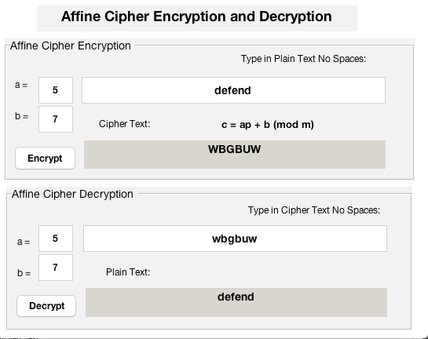

What is Affine Cipher 
---

The affine cipher is a type of monoalphabetic substitution cipher, where each letter in an alphabet is mapped to its numeric equivalent, encrypted using a simple mathematical function, and converted back to a letter. 

Reference
---
[1] https://en.wikipedia.org/wiki/Affine_cipher
